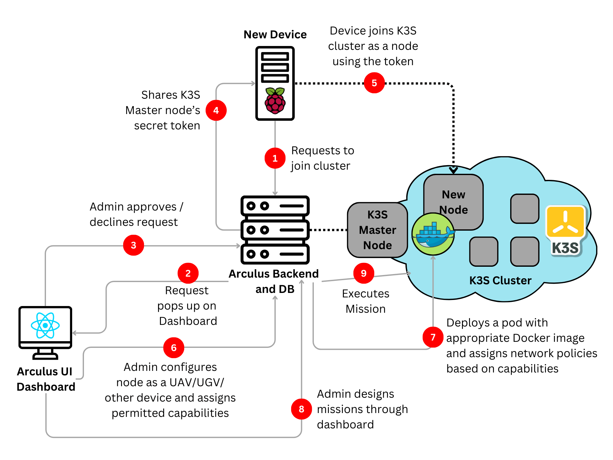

# Arculus Architecture and Workflow

The architecture of Arculus is built upon a K3s-based device cluster management and MySQL database effectively and securely handled by a Node.js backend with a JWT-token based authorization. The seamless management of users, devices, and mission executions is carried out with ease using a ReactJS user interface. The below figure presents a detailed workflow of the Arculus system.

## Workflow Diagram

