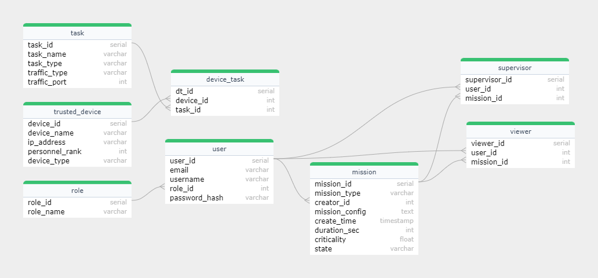

# Database Schema

The schema of the Arculus relational database is defined in an SQL file located at `arculus-gcs/arculus-gcs-mysql/db-schema.sql`. The following E-R diagram outlines the tables in the database, their columns, and the relationships between the tables.

## ER Diagram

