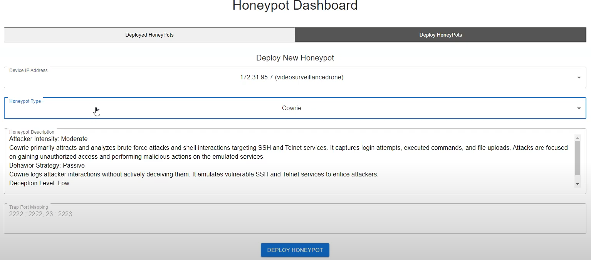
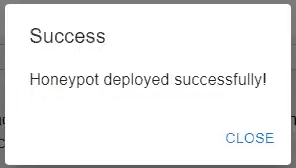
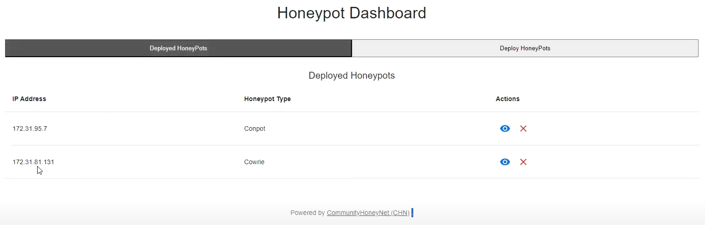
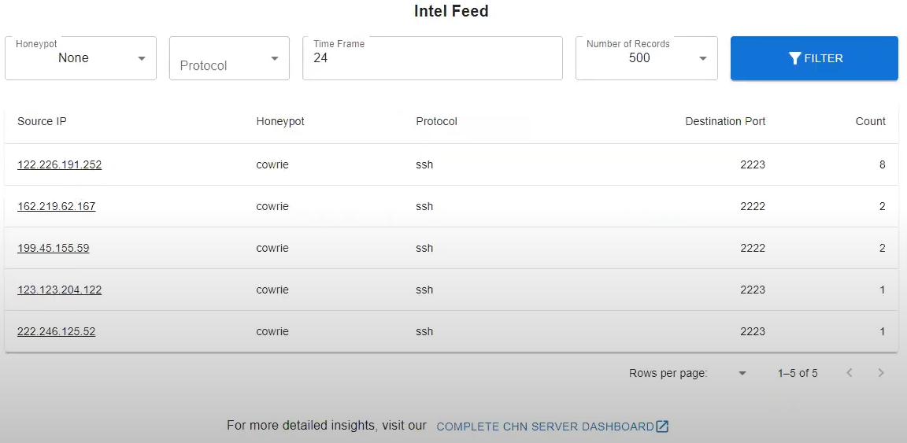
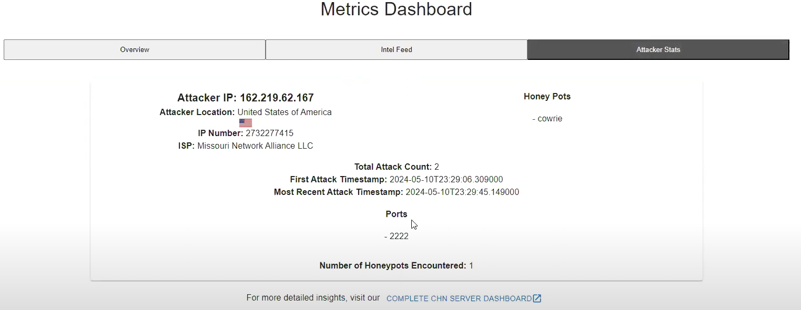
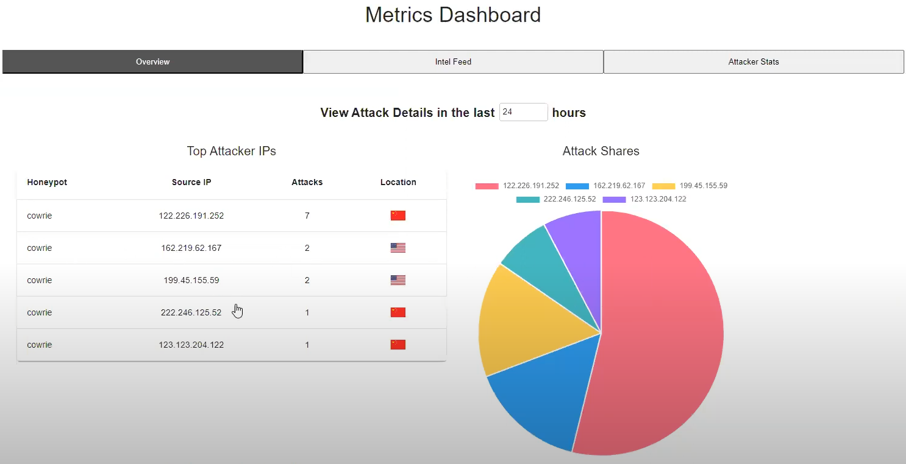

# Deploying Honeypots

## Overview
The Honeypot Deployment section of the Arculus application is designed to manage the deployment and monitoring of honeypots within the network. It provides tools for deploying new honeypots, managing deployed honeypots, and analyzing metrics and statistics from honeypot interactions.

## Functional Overview
The Honeypot Deployment functionality is divided into two main areas:

1. **Deploying New Honeypots**: Administrators can deploy new honeypots on specified devices within the network, configuring them according to the type of honeypot and its specific settings.
   
2. **Monitoring Deployed Honeypots**: Provides a view of all currently deployed honeypots, with options to manage or undeploy them as needed.

## Components
The flow involves several interconnected components that provide a robust management system for honeypots:

### [`<HoneypotDashboard />`](/docs/arculus-ui/components/honeyNet/honeypotDashboard)
- **Functionality**: Acts as the main dashboard for honeypot deployment and monitoring, with tabbed navigation between deployed honeypots and the deployment interface.
- **User Actions**: Administrators can switch between viewing deployed honeypots and deploying new ones. This component integrates [`<DeployedHoneypots />`](/docs/arculus-ui/components/honeyNet/deployHoneypots) and [`<DeployHoneypots />`](/docs/arculus-ui/components/honeyNet/deployedHoneypots) for detailed functionalities.

### [`<DeployHoneypots />`](/docs/arculus-ui/components/honeyNet/deployedHoneypots)
- **Functionality**: Allows administrators to deploy new honeypots by specifying the device IP, honeypot type, and port mappings.
- **User Actions**: After filling out the deployment form, administrators can deploy the honeypot, which then becomes part of the network's defensive mechanisms.

### [`<DeployedHoneypots />`](/docs/arculus-ui/components/honeyNet/deployHoneypots)
- **Functionality**: Lists all currently deployed honeypots and provides options to undeploy or manage settings.
- **User Actions**: Administrators can review the active honeypots, undeploy any that are no longer needed, or adjust their configurations.

## [`<MetricsDashboard />`](/docs/arculus-ui/components/honeyNet/metricsDashboard)
Additionally, the [`<MetricsDashboard />`](/docs/arculus-ui/components/honeyNet/metricsDashboard) component provides detailed analytics and statistics from honeypot interactions, enhancing the visibility into network threats and attacker behaviors.

### MainDashboard
- **Overview**: Displays general metrics about network attacks detected by honeypots, including data visualization of attack origins and types.
- **Details**: Shows specific statistics about attack frequencies, types, and targeted honeypots.

### IntelFeed
- **Functionality**: Provides a detailed feed of all recent honeypot interactions, filtering by various criteria such as honeypot type, protocol, or time frame.
- **User Actions**: Administrators can filter and analyze specific data points to gain insights into the nature of the attacks and attacker methods.

### AttackerStats
- **Functionality**: Offers detailed statistics and information on specific attackers, including their geographical location, attack methods, and target preferences.
- **User Actions**: This component is useful for in-depth analysis of repeated attacks or significant security events.

## Security and Accessibility
Only users with appropriate administrative rights have access to the Honeypot Deployment functionalities, ensuring that the deployment and management of honeypots are controlled and secure.

