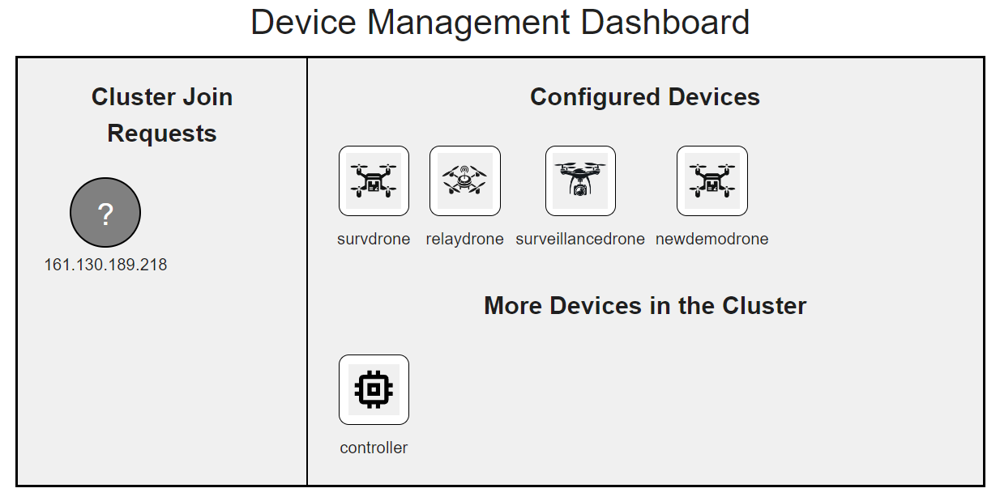
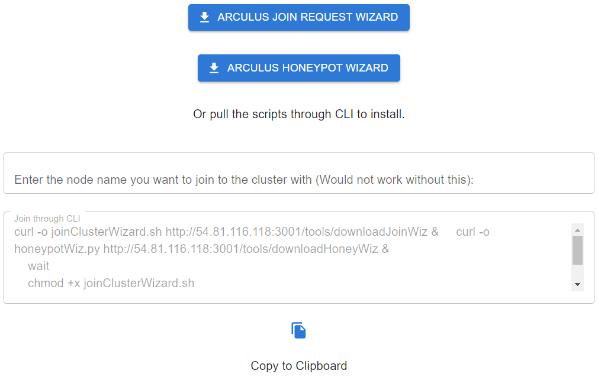
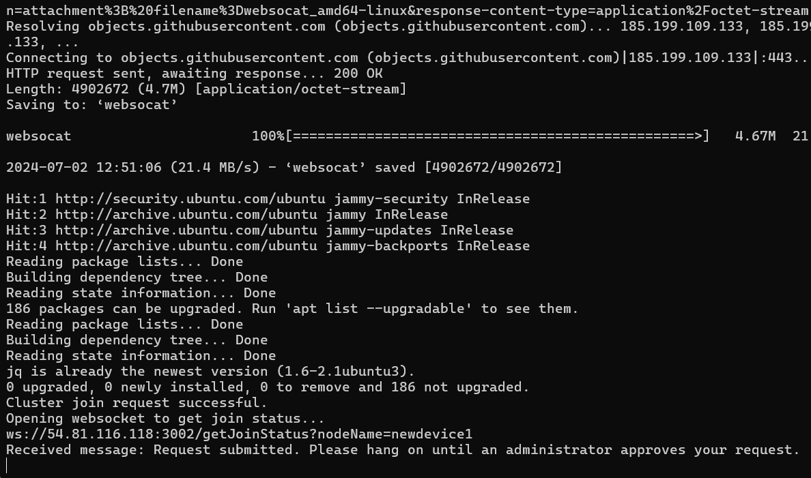
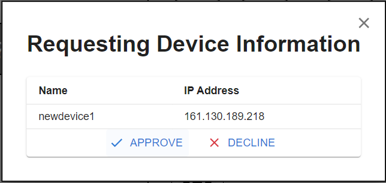
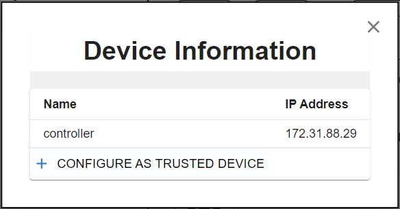
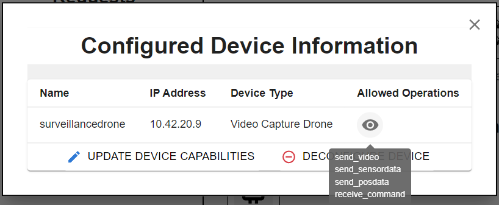

# Managing Devices in the Cluster

## Overview
The Device Management section of the Arculus application provides a comprehensive suite of tools for administrators, particularly those involved in managing network device configurations and handling cluster membership requests. It facilitates the integration, configuration, and management of devices within a controlled network environment, supporting the operational efficiency and security of the system.

## Functional Overview
This section is designed to handle several critical functions, enabling administrators to manage devices effectively:

1. **Handling Cluster Join Requests**: Administrators can approve or reject new devices requesting to join the network cluster. This function ensures that only authorized devices are added, maintaining the security and integrity of the network.

2. **Configuring Trusted Devices**: Once a device is part of the cluster, administrators can configure it as a trusted device. Trusted devices are granted specific permissions and roles within the network, aligning with organizational security policies.

3. **Device Configuration and Management**: Administrators can update or remove devices from the cluster. This includes modifying device configurations or completely deconfiguring them as trusted devices, thereby revoking all previously granted permissions.

## Integration with Add Nodes Script
The integration of the Device Management dashboard with the `Add Nodes` script, facilitated through the [`<DownloadTools />`](/docs/arculus-ui/components/downloadTools) component, forms a crucial part of the device management workflow:

- **Script Download and Execution**: Administrators direct new devices to download and execute the `Add Nodes` script from the [`<DownloadTools />`](/docs/arculus-ui/components/downloadTools) component. This script automates the request for the new device to join the network cluster.
  

- **Approval/Rejection of Join Requests**: The Device Management dashboard receives these requests, where administrators can approve or reject them. Approved devices are added to the cluster and can subsequently be configured with specific roles and permissions.

- **Configuration of Virtualized Behavior**: Once a device is part of the cluster, it can be configured to behave as a certain type of device by running virtualized services. These configurations are managed through K3s pods, allowing for flexible and scalable device management.

## Security and Accessibility
To ensure the security of the network, the Device Management dashboard is accessible only to administrators with appropriate privileges. This restricted access helps prevent unauthorized modifications and maintains the integrity of the device configurations within the network.

## User-Centric Features
The Device Management interface is designed for ease of use, ensuring that administrators can efficiently manage devices without needing in-depth technical knowledge:

- **Interactive Approval/Rejection**: Devices requesting to join the cluster can be easily approved or rejected through a user-friendly interface on the dashboard.
- **Simple Configuration Interface**: Configuring a device as trusted or modifying its roles is straightforward, with intuitive forms and clear instructions.
- **Secure Deconfiguration Options**: Removing a device or revoking its trusted status involves confirmation steps to prevent accidental changes, ensuring that such actions are deliberate and necessary.

### Watch User and Device Management Tutorial Below

