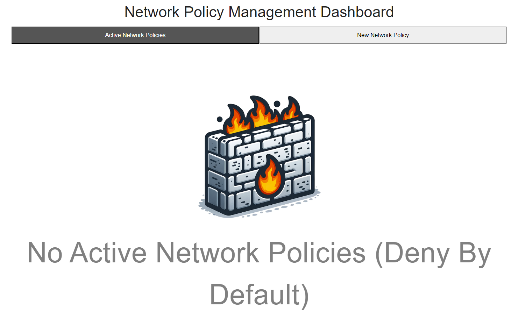
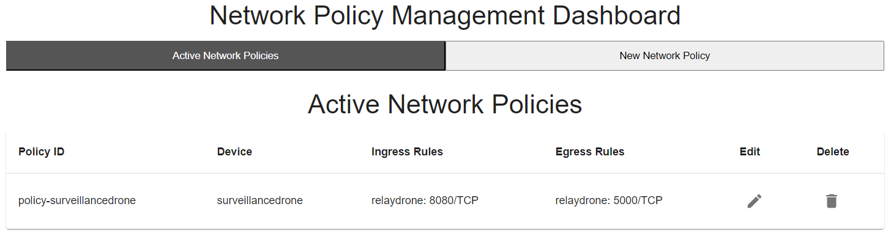
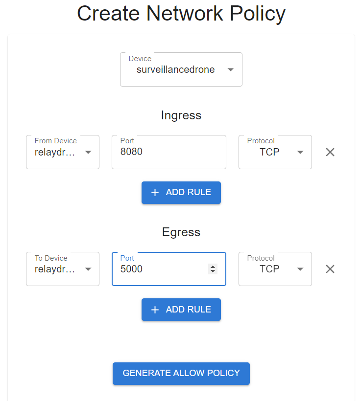

# Managing Network Policies

## Overview
The Network Policy Management section of the Arculus application allows administrators to manage and enforce network policies that govern the traffic flow among devices within a cluster. This includes the ability to view, create, update, and delete network policies dynamically.

## Functional Overview
Administrators have several capabilities within this module:

1. **Viewing Active Network Policies**: Provides a comprehensive list of all active policies, excluding default policies that deny all traffic by default unless explicitly allowed.
   

2. **Creating New Network Policies**: Enables the creation of customized network policies that specify which traffic is allowed to and from devices based on specified criteria.

3. **Updating and Deleting Network Policies**: Offers the ability to modify existing policies or remove them if they are no longer needed.

4. **Automation During Missions**: Network policies are created and deleted automatically during mission executions to enable just-in-time access to network privileges, enhancing security and efficiency.

## Components
This flow involves several components:

### ListPolicies
- **Functionality**: Displays all active network policies, allows for the deletion of policies, and provides an interface to view detailed policy configurations.
- **User Actions**: Administrators can delete unwanted policies through a confirmation dialogue, ensuring careful consideration before making changes.

### CreatePolicy
- **Functionality**: Offers a form to specify the details for a new network policy, including ingress and egress rules.
- **User Actions**: Administrators can add ingress and egress rules specifying the allowed communications between different devices. The form dynamically adjusts to allow for the detailed specification of these rules.

### ManagePolicies
- **Functionality**: Acts as the main dashboard for network policy management, integrating both the ListPolicies and CreatePolicy components into a tabbed interface.
- **User Actions**: Administrators can switch between viewing active policies and creating new ones, facilitating easy management of network policies from a single interface.

## Security and Accessibility
Access to this dashboard is restricted to users with administrative privileges to prevent unauthorized changes to network policies, which could impact the operational security and integrity of the network.

## User-Centric Features
- **Interactive Interface**: The tabbed layout and detailed forms ensure that administrators can easily manage policies without navigating away from the dashboard.
- **Dynamic Updates**: Real-time updates to the policy list and instant feedback on the creation of new policies ensure that changes are reflected immediately.

