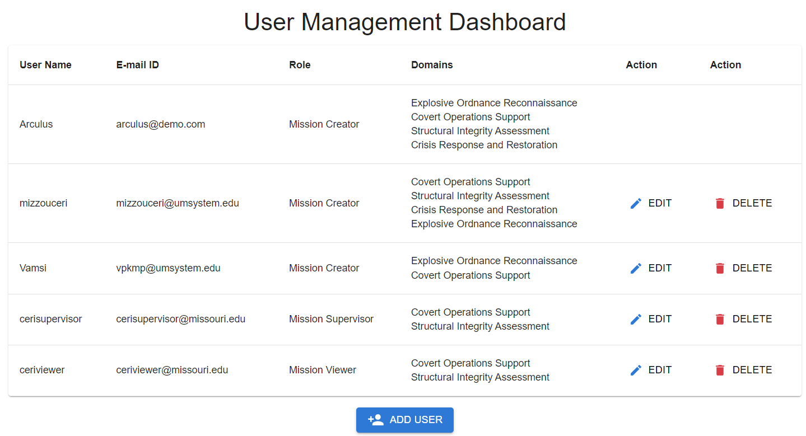
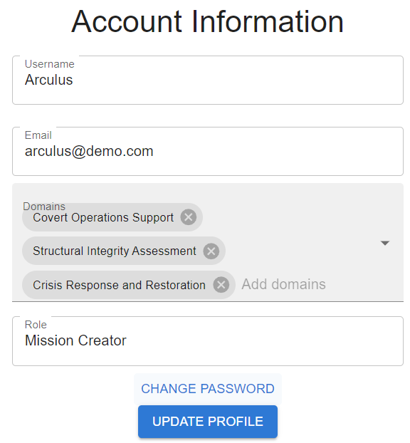

# Managing Users

## Overview
The User Management section of the Arculus application is a powerful tool designed for administrators, specifically those with the `Mission Creator` role. It allows for comprehensive control over user accounts, enabling the addition, modification, and deletion of users based on their designated roles and operational domains.

## Functional Overview
This dashboard is structured to facilitate several key activities that help maintain the integrity and organization of user data:

1. **Viewing All Users**: Provides a clear and organized list of all users within the system, displaying essential information such as usernames, email addresses, roles, and associated domains. This overview aids administrators in quickly understanding who has access to the system and their roles.

2. **Adding New Users**: Features an intuitive interface for registering new users into the system. Administrators can input vital information like names, contact details, roles, and domains, ensuring that new users are set up with the correct permissions and access right from the start.

3. **Editing User Information**: Offers the ability to update existing user profiles. This is particularly useful for changing user roles or updating contact information as needed, ensuring that each user’s details remain relevant and accurate. This can be done either of the [`<ManageUsers />`](/docs/arculus-ui/components/userManagement/manageUsers) and [`<AccountDashboard />`](/docs/arculus-ui/components/userManagement/accountDashboard) dashboards.

4. **Removing Users**: Includes a secure process for deleting users who no longer require access to the system. This feature is accompanied by a confirmation step to prevent accidental deletions, ensuring that removals are deliberate and necessary.

## User-Centric Features
The dashboard is designed with user-friendliness in mind, employing straightforward interfaces that require no technical knowledge to use:

- **User List**: An easy-to-navigate list that provides all necessary details at a glance, making it simple to manage and review user accounts.
- **Add User**: A straightforward form that captures all necessary user details, designed to ensure that new users are quickly and efficiently added to the system.
- **Edit User**: A similar form that allows for quick updates to user details, making it easy to keep user information current.
- **Delete User**: A secure step that involves confirming the decision, providing a safeguard against unintended deletions.

## Security and Accessibility
Ensuring only authorized access, the dashboard is accessible solely to users with administrative privileges. This level of access control helps maintain the security and integrity of user data within the application.
