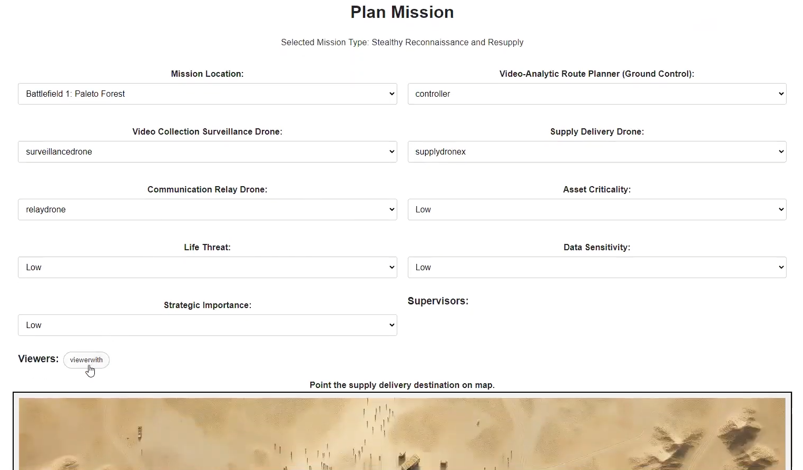
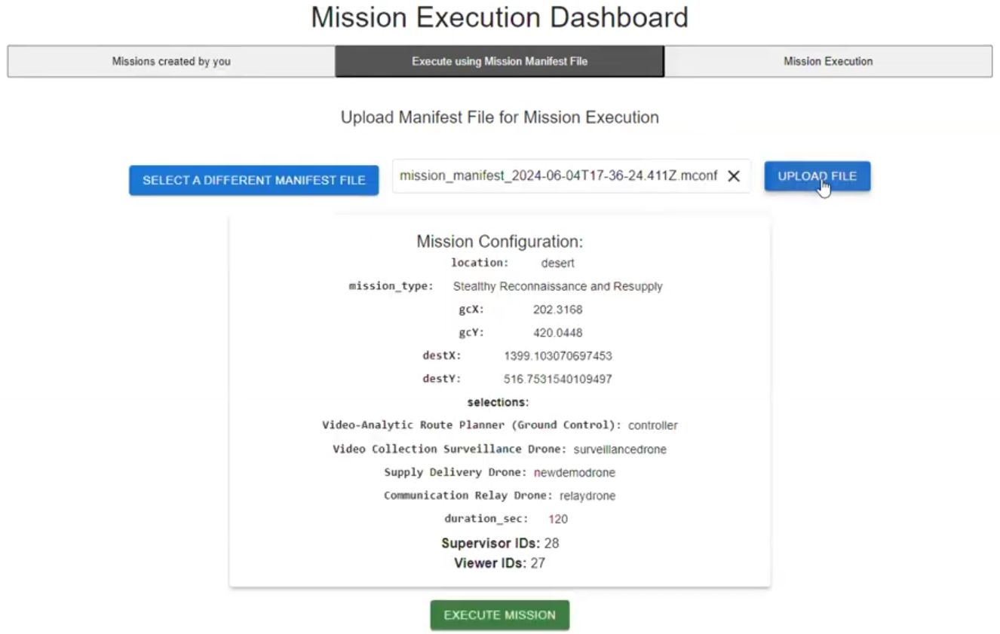

# Planning and Executing Missions

## Overview
The Mission Planning and Execution section in the Arculus platform enables users to define, manage, and execute various military or exploratory missions. This includes setting mission parameters, deploying resources, and monitoring in real-time.

## Functional Overview
Mission Planning and Execution is structured into several components:

### Mission Planner
- **Functionality**: Facilitates the selection and detailed configuration of a mission based on predefined parameters that can be adjusted for specific requirements.
- **User Actions**: Users can select a mission type, configure devices, set location, and define mission critical parameters. The configured mission can either be executed directly or can be downloaded as an encrypted manifest file that can only be decrypted by logging in as an authorized user. 

#### Watch Mission Planning Tutorial Below

### Mission Execution
- **Functionality**: Provides real-time tracking and management of the mission, including drone movements, critical alerts, and mission status updates.
- **User Actions**: Users can monitor the mission progress, intervene manually if necessary, and simulate various scenarios to test mission resilience.

## Configurability
The system's flexibility is significantly enhanced through the `missionSettings.json` file, which defines the configurations for various mission types. This file specifies the devices involved, roles required, and other mission-specific parameters, making it easy to adjust settings without changing the core application code.

### Key Features:
1. **Dynamic Device Allocation**: The system dynamically assigns devices based on the mission type selected, pulling configurations directly from the `missionSettings.json`.
2. **Role-Based Access Control**: Ensures that only authorized personnel can access certain mission planning capabilities based on their role defined in the mission settings.
3. **Adjustable Parameters**: Mission parameters like asset criticality, data sensitivity, and strategic importance are configurable, allowing tailored mission planning.

## Components

### ListMissions
- **Functionality**: Lists all missions created by the user with options to execute, monitor, or delete based on mission state and user privileges.
- **User Actions**: Users can start, view, or remove missions directly from this component.

### MissionExecution
- **Functionality**: Offers a detailed operational view during mission execution, providing tools for direct intervention and scenario simulation like GPS spoofing or communication loss.
- **User Actions**: Users can observe real-time data, simulate threats, and control mission outcomes dynamically.

## Security and Accessibility
Configurable security measures are implemented to ensure that mission data integrity and confidentiality are maintained, supporting secure access and data handling according to user roles and mission sensitivity.

### Watch mission execution demos under various scenarios below:
     