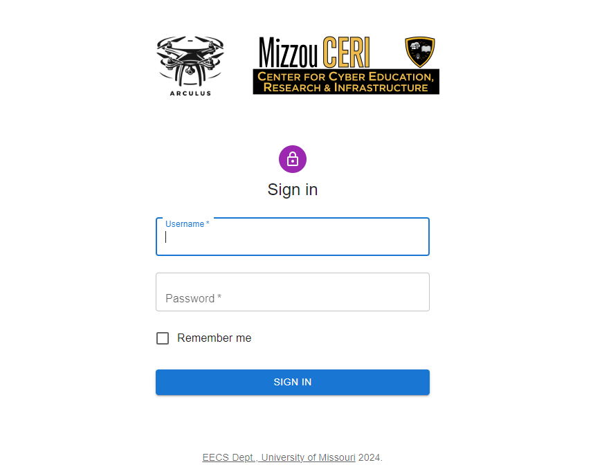

# Signing In

## Overview
The SignIn page is a crucial part of the authentication flow for the application. It utilizes the `<SignIn />` component to handle user sign-in functionality, ensuring that users can access the system with valid credentials. It is the default page a user lands on when he/she is not signed in. The `<Routing />` component checks for a valid JWT token. If the token is not found or seems to be invalidated by the [`Auth/Authorize`](/docs/arculus-api/Auth#get-authorize) API, it redirects the user to this page. 

## SignIn Page Functionality
The primary purpose of the SignIn page is to render the sign-in form and process user authentication. This involves:
1. Displaying a sign-in form where users can enter their username and password.
2. Sending the entered credentials to the [`Auth/Login`](/docs/arculus-api/Auth#post-login) API form submissions to authenticate users and receive an auth token valid for one hour.
3. Managing authentication state and navigating users to the appropriate page upon successful login.
